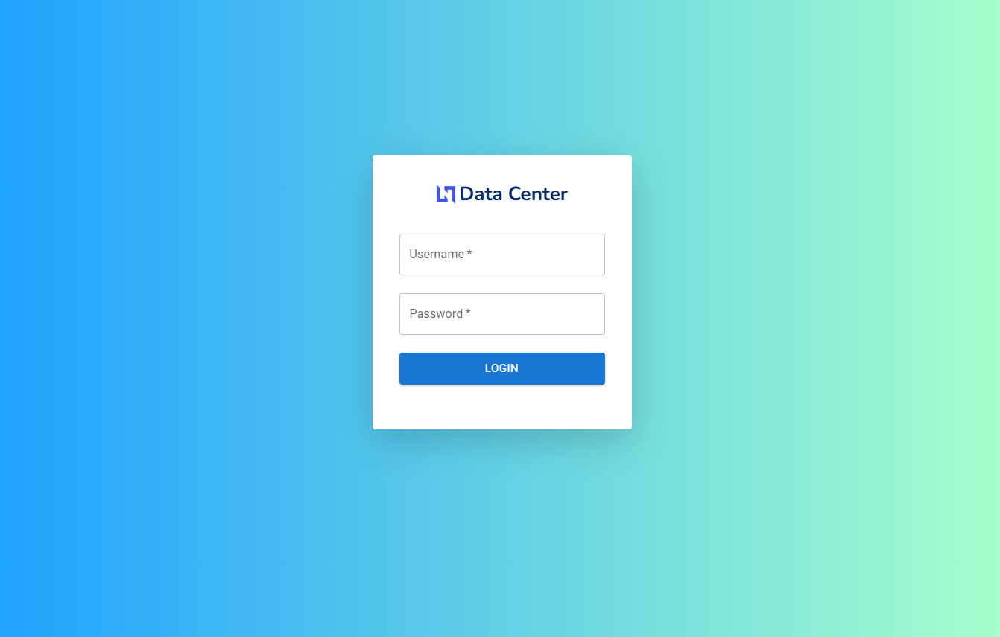

# Datacenter Project (MERN + TypeScript)

A full-stack data visualization dashboard built with **React (TypeScript)** and **Node.js (Express + TypeScript)**.  
The client app fetches data from a **custom Node API**, which in turn retrieves data from a **third-party API**, processes it, and stores the results in **MongoDB**.



## Repositories

- Backend (API): https://github.com/m-antoni/datacenter-api-vr2
- Frontend (React UI): https://github.com/m-antoni/datacenter-react-ts-v2

## Tech Stack

**Frontend**

- React + TypeScript
- Redux for state management
- MUI-Datatables for interactive tables
- Axios for HTTP requests

**Backend**

- Node.js (Express) + TypeScript
- MongoDB + Aggregation Framework
- Joi for validation
- JWT for authentication

## Architecture Overview

1. The **React client** fetches data from the **Node API**.
2. The **Node API** makes external calls to a **third-party API**.
3. Data from the third-party API is validated using **Joi**, transformed using **MongoDB Aggregation**, and saved into MongoDB.
4. The client displays the results in a structured data table using **MUI-Datatables**.

## API Overview

The Node API provides routes to:

- Fetch data from the third-party API
- Store data in MongoDB
- Retrieve processed data for the dashboard
- Handle JWT authentication

## Key Features

- Type-safe full stack using TypeScript
- End-to-end data flow: external API → backend → MongoDB → frontend
- Input validation via **Joi**
- Secure authentication via **JWT**
- Interactive, filterable data tables via **mui-datatables**

## Environment Variables

### Client (.env)

```
REACT_APP_API_URL=http://localhost:5000/api
```

### Server (.env)

```
NODE_ENV=development
PORT=5000
MONGO_PATH=mongodb+srv://cluster0.xxxxx.mongodb.net
MONGO_USER=your_user
MONGO_PASSWORD=your_password
JWT_SECRET=your_secret_key
```

---

## Installation & Setup

### Clone the Repositories

```bash
# Client
git clone https://github.com/m-antoni/datacenter-react-ts-v2
cd datacenter-react-ts-v2
npm install

# API
git clone https://github.com/m-antoni/datacenter-api-vr2
cd datacenter-api-vr2
npm install
```

### Run the Development Servers

```bash
# Start API
npm run dev

# Start Client
npm start
```

### Author

- **Michael Antoni**
- **michaelantoni.tech@gmail.com**
